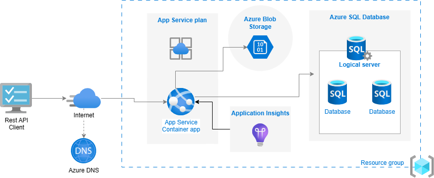
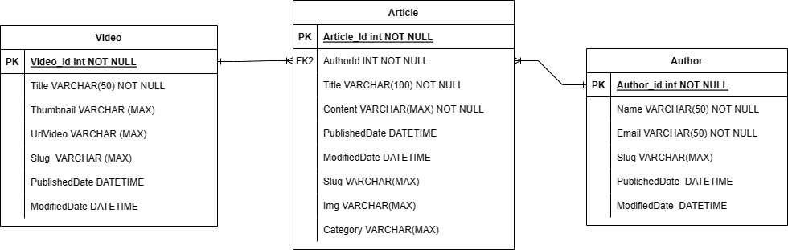
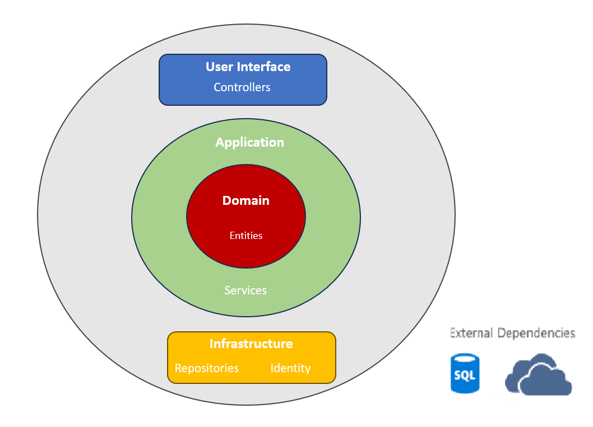
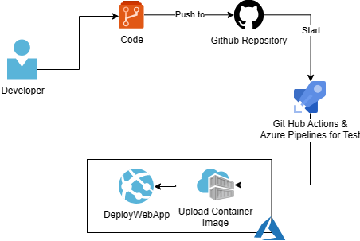

# TechChallenge03 - API Blog de notícias com teste de unidade e integração

O Tech Challenge 03 engloba o desenvolvimento de API web para um blog de notícias utilizando Onion Architecture com autenticação/autorização através do identity framework e execução de teste de unidade e integração com XUnit. O projeto em si contém uma aplicação Web API desenvolvida em ASP.NET 7 , na qual, é responsável por toda a lógica da aplicação e comunicação com o banco de dados. O projeto também conta com um pipeline de integração e entrega contínua (CI/CD) no Github Actions, de modo de automatizar o processo de implantação de ponta a ponta. Além de possuir um outro pipeline do azure para automatização dos testes de unidade e integração do projeto.

Abaixo é possível verificar a arquitetura da Applicação no Azure:



O projeto contem um Container Web App que é alimentado por um instância de uma imagem gerada a partir do build da aplicação contida nesse repositório através do continuos integration. A imagem pode ser obtita a partir do link `cmellorepository.azurecr.io/cmellorepository/techchallenge03:latest` que está amarzenada em um Container Register do Azure.

A Web App também é conectada com o Azure SQL para armazenar os dados da API como os artigos, videos, autores e usuários. Podendo assim, fazer todos o controle de usuários e artigos do sistema.

Para conexão com o banco de dados foi utilizado Entity Framework Core e desenvolvido o CRUD com Repository pattern que pode ser encontrado sua implementação na camada de Infraestrutura. Design do banco de dados:



O banco de dados conta com as tabelas descritas acima mais as tabelas geradas para o controle de autenticação e autorização de usuáridos do IDENTITY Framework.

## Arquitetura padrão utilizada

Confome dito acima, foi utilizado o padrão de arquitetura cebola também chamada de arquitetura limpa. A arquitetura "cebola" é um conceito de design para sistemas de software que enfatiza camadas de abstração e isolamento. Inspirada em uma cebola com várias camadas, cada camada representa um nível de funcionalidade e depende das camadas internas para funcionar. Isso promove a modularidade, reusabilidade e manutenção do sistema, permitindo que cada camada se concentre em uma responsabilidade específica. Uma jeito comum de visualizar essa arquitetura é através de uma série de circulos concentricos similares a uma cebola conforme pode ser visto na imagem abaixo :



Por tanto a estrutura do projeto ficou dividido conforme demonstrado abaixo:

    ```
    |--docs - Documentação e diagramas
    |--src
      |-- Api - A camada de interface do usuário e comunicação externa. Ela recebe solicitações e fornece respostas, atuando como ponto de entrada para interações com o sistema.
      |-- Application - A camada de interface do usuário e comunicação externa. Ela recebe solicitações e fornece respostas, atuando como ponto de entrada para interações com o sistema.
      |-- Domain - A camada de domínio encapsula as regras centrais e a lógica de negócios da aplicação. Ela modela os conceitos fundamentais e as relações do problema que a aplicação está resolvendo.
      |-- Infrastructure.Data - Responsável pelo acesso e gerenciamento dos dados da aplicação. Isso inclui interações com bancos de dados, armazenamento de informações e operações relacionadas.
      |-- Infrastructure.Identity - Lida com aspectos de autenticação e autorização dos usuários. É responsável por gerenciar a identidade dos usuários e suas permissões.
      |-- Infrastructure.Ioc - Esta camada se refere à inversão de controle (IoC) e à configuração de dependências. Ela controla como as diferentes partes do sistema se conectam e interagem, promovendo a flexibilidade e a manutenção.
    ```

## CI/CD

Esse projeto possui um pipeline de integração e entrega continua (CI/CD) com github action , de modo de automatizar o processo. além disso, apresenta um segundo azure pipeline para os testes de integração e unidade do projeto. O fluxo desse processo pode ser visto na imagem abaixo:



1. O desenvolvedor faz um push para o repositório do github na branch master.
2. O pipeline do GitHub Actions e Azure pipelines é iniciado.
3. Inicia-se o processo de build do projeto e após o termino é criado uma imagem de container com o resultado do build e é executado os testes de integração e unidade.
4. Essa nova imagem é carregada no Azure Container Register.
5. Com a nova imagem no ACR, é feito o deploy da mesma em um Web For Container.
6. API atualizada e disponibilizada para o usuário.

## Aplicação

O Projeto não possue front end, sendo assim, foi disponibilizado somente os endpoint para comunicação através de alguma ferramente de mercado que faça requisições HTTP ou swagger.
São disponibilizados 4 endpoints na api: Article, Author, Video, User e Upload, sendo que para utilizar os três primeiros endpoints é necessário estar autenticado na API com JWT.
Então para qualquer requisição que for feita nesses três endpoints (Article,Author e Video) é necessário enviar no header da requisição um Bearer Token que será disponibilizado ao autenticar o usuário no endpoint `/api/User/Login`.

Para fazer o cadastro de um artigo é necessário antes de criado pelo menos um autor para ser enviada na requisição.

### URL de Acesso

Para testar a API sem ter que criar toda a infraestrutura, estou disponibilizando as URLs de acesso temporariamente nos links abaixo:

1. URL `https://techchallenge03.azurewebsites.net/api/<Colocar_final_endpoint>` para acesso com Postman , etc.
2. URL `https://techchallenge03.azurewebsites.net/swagger/index.html` para acesso via Swagger.

### Métodos

Requisições para a API devem seguir os padrões:
| Método | Descrição |
|---|---|
| `GET` | Retorna informações de um ou mais registros. |
| `POST` | Utilizado para criar um novo registro. |
| `PUT` | Atualiza dados de um registro ou altera sua situação. |
| `DELETE` | Remove um registro do sistema. |

### Respostas

| Código | Descrição                                                          |
| ------ | ------------------------------------------------------------------ |
| `200`  | Requisição executada com sucesso (success).                        |
| `201`  | Criação o objeto com sucesso                                       |
| `400`  | Erros de validação ou os campos informados não existem no sistema. |
| `401`  | Usuário não autorizado.                                            |
| `500`  | EndPoint não encontrado,                                           |

### Controller [/User]

Reponsável pelo controle de usuário e autenticação da API. Nele é onde será feito a criação do usuário e recebimento do token para autenticação nos outros endpoints.

| Método | URL               | Descrição         | Parâmetros [JSON]                   | Retorno |
| ------ | ----------------- | ----------------- | ----------------------------------- | ------- |
| `POST` | [api/User/signUp] | Cadastra usuário. | email,password,passwordConfirmation | ------- |
| `POST` | [api/User/login]  | Loga o usuário.   | email, password                     | Token   |

### Controller Article

Responsável pelo controle de artigos da API. Esse endpoint deve ser utilizado somente depois de estar autenticado e e deve ser passado no header da requisição o token do usuário.
OBS: Deve ser criado antes ao menos um autor e uma categoria para ser passada de parámetro.

| Método   | URL                | Descrição                             | Parâmetros [JSON]                 | Retorno          |
| -------- | ------------------ | ------------------------------------- | --------------------------------- | ---------------- |
| `POST`   | [api/Article]      | Cadastra um novo artigo.              | title,content,authorId,categoryId | ---------------- |
| `GET`    | [api/Article]      | Retorna todos os usuários.            | --------------------------------- | Lista de artigos |
| `GET`    | [api/Article/{id}] | Retorna o artigo informado na URL.    | --------------------------------- | Artigo           |
| `PUT`    | [api/Article]      | Atualiza alguma informação do artigo. | id,title,content                  | ---------------- |
| `DELETE` | [api/Article/{id}] | Delete o artigo informado na URL.     | --------------------------------- | ---------------- |

### Controler Author

Responsável pelo controle de autores da API. Esse endpoint deve ser utilizado somente depois de estar autenticado e deve ser passado no header da requisição o token do usuário.

| Método   | URL               | Descrição                            | Parâmetros [JSON] | Retorno          |
| -------- | ----------------- | ------------------------------------ | ----------------- | ---------------- |
| `POST`   | [api/Auhtor]      | Cadastra um novo autor.              | name,email        | ---------------- |
| `GET`    | [api/Author]      | Retorna todos os usuários.           | ----------------- | Lista de autores |
| `GET`    | [api/Author/{id}] | Retorna o autor informado na URL.    | ----------------- | Autor            |
| `PUT`    | [api/Author]      | Atualiza alguma informação do autor. | id,name,email     | ---------------- |
| `DELETE` | [api/Author/{id}] | Delete o autor informado na URL.     | ----------------- | ---------------- |

### Controller Video

Responsável pelo controle de categorias da API. Esse endpoint deve ser utilizado somente depois de estar autenticado e deve ser passado no header da requisição o token do usuário.

| Método   | URL                 | Descrição                         | Parâmetros [JSON]   | Retorno            |
| -------- | ------------------- | ----------------------------------| ------------------- | ------------------ |
| `POST`   | [api/Video]      | Cadastra um novo video.              | name,description    | ----------------   |
| `GET`    | [api/Video]      | Retorna todos as videos.             | ------------------- | Lista de categoria |
| `GET`    | [api/Video/{id}] | Retorna a video informado na URL.    | ------------------- | Categoria          |
| `PUT`    | [api/Video]      | Atualiza alguma informação da video. | id,name,description | ----------------   |
| `DELETE` | [api/Video/{id}] | Delete a video informado na URL.     | ------------------- | ----------------   |

### Controller Upload

Responsável pelo upload de videos e imagens no azure BlogStorage. Esse endpoint deve ser utilizado somente depois de estar autenticado e deve ser passado no header da requisição o token do usuário.

| Método   | URL                 | Descrição                                              | Parâmetros [IFormFile] | Retorno            |
| -------- | ------------------- | ------------------------------------------------------ | ---------------------- | ------------------ |
| `POST`   | [api/Upload]      | Faz o upload de uma nova imagem ou video um novo video.  | Image/Video            | ----------------   |


## Pré-Requisitos

1. .NET7

Execute os próximos passos somente se for criar uma infraestrutura nova ou rodar a aplicação localmente no seu PC.

### Configuração do Infraestrutura

1. Necessário criar manualmente um WebApp for Container no Azure.
2. Criar um Azure SQL para criação do banco de dados.
3. Criar o azure Blog Storage com os devidos containers.
4. Criar o application insights.

### Configuração SQL Server

1. Verifique se sua connection string in `Api/appsetting.json` aponta para o banco de dados, azure blob storage e application insights.
   ```
      "ConnectionStrings": {
         "SqlConnection": "<SQL_DB_AZURE_CONNECTION_STRING>"
      },
      "AzureStorage": {
         "ConnectionString": "<ADD_AZURE_BLOB_STORAGE_CONNECTION_STRING>",
         "ImageContainerName": "images-container",
         "VideoContainerName": "videos-container"
      },
      "ApplicationInsights": {
         "InstrumentationKey": "<ADD_APPLICATION_INSIGHTS_KEY>"
      },

   ```
2. Verifique se EF Tool já está instalado.
   ```
   dotnet tool update --global dotnet-ef
   ```
3. Abra um prompt de comando na pasta Api e execute os seguintes comandos:

   ```
   dotnet restore
   dotnet tool restore
   dotnet ef database update -c AppDbContext -p ../Infrastructure.Data/Infrastructure.Data.csproj -s Api.csproj
   dotnet ef database update -c IdentityDataContext -p ../Infrastructure.Identity/Infrastructure.Identity.csproj -s Api.csproj

   ```

   Esses comandos irão criar um banco de dados no SQL com as tabelas utilizadas no projeto.

## Erros Conhecidos
